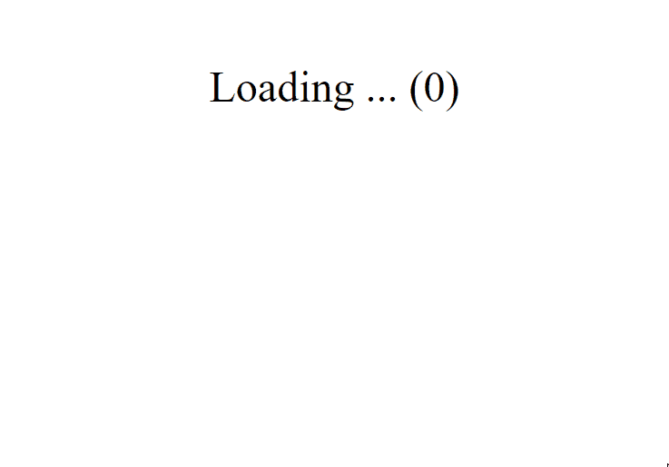

[RxJS](https://rxjs.dev/) has a lot of operators, and most of the time we grab for the same operators.
On rare occasions, these frequently used operators aren't enough, for me that was the case while I was writing [rx-query](https://github.com/timdeschryver/rx-query).

You can think of rx-query as a wrapper around HTTP requests, it automatically retries and caches queries, and it keeps track of the request state (`loading`, `refreshing`, `success`, and `error`). When a query fails, rx-query has a retry built-in and it emits the retry count to the consumer.

To give you an idea, this is how it looks like when a query failed and is retrying:



The implementation of the above screen looks like this with rx-query:

```ts{6-12,25-28}
@Component({
  selector: 'app-root',
  template: `
    <ng-container *ngIf="characters$ | async as characters">
      <ng-container [ngSwitch]="characters.state">
        <div *ngSwitchCase="'loading'">
          Loading ... ({{ characters.retries }})
        </div>

        <div *ngSwitchCase="'error'">
          Something went wrong ... ({{ characters.retries }})
        </div>

        <div *ngSwitchDefault>
          <ul>
            <li *ngFor="let character of characters.data">
              <a [routerLink]="character.id">{{ character.name }}</a>
            </li>
          </ul>
        </div>
      </ng-container>
    </ng-container>
  `,
})
export class AppComponent {
  characters$ = query('characters', () =>
    this.rickAndMortyService.getCharacters(),
  )

  constructor(private rickAndMortyService: RickAndMortyService) {}
}
```

To implement the retry feature, I intended to use [Alex Okrushko](https://twitter.com/AlexOkrushko)'s library, [backoff-rxjs](https://github.com/alex-okrushko/backoff-rxjs). But because this library uses the [`retryWhen` operator](https://rxjs.dev/api/operators/retryWhen), it doesn't emit a value on a retry. The `retryWhen` operator only emits a value when it succeeds or when the implementation rethrows the error.

This isn't what I had in mind for rx-query because the retry count might be important.
I started to look at the RxJS operators that I'm unfamiliar with, and the [`expand` operator](https://rxjs.dev/api/operators/expand) looked suitable. After reading [Nicholas Jamieson](https://twitter.com/ncjamieson)'s post "[RxJS: Understanding Expand](https://ncjamieson.com/understanding-expand/)", in which he compares the operator to a [delay pedal](<https://en.wikipedia.org/wiki/Delay_(audio_effect)>), I was confident that this was the operator I was looking for.

> It's similar to `mergeMap`, but applies the projection function to every source value as well as every output value. It's recursive.

To give you an understanding on how you can use it, we're going to implement the retry functionality in small iterations.

The first step is to show the result of the request.
Within an Angular application this is common, and we use the [`async` pipe](https://angular.io/api/common/AsyncPipe) to unwrap the value from an Observable (in this case the HTTP request).

```ts
@Component({
	selector: 'app-root',
	template: `<pre>{{ characters$ | async | json }}</pre>`,
})
export class AppComponent {
	characters$ = this.rickAndMortyService.getCharacters();

	constructor(private rickAndMortyService: RickAndMortyService) {}
}
```

But what happens if the service throws an error? In most of the application code, only the happy path is implemented and the unhappy paths are often forgotten (or poorly implemented).
In this case, when the service fails, we end up the value `null`.

To handle errors, we use the [`catchError` operator](https://rxjs.dev/api/operators/catchError).
To keep things simple, we simply return the error in this example.

While it's important to correctly handle errors for our users, catching this error is also important for the next step.
This will make sure that the consumer will receive a notification, instead of an error.

```ts{7-11}
@Component({
  selector: 'app-root',
  template: `<pre>{{ characters$ | async | json }}</pre>`,
})
export class AppComponent {
  characters$ = this.rickAndMortyService.getCharacters().pipe(
    catchError((err) =>
      of({
        error: err,
      }),
    ),
  )

  constructor(private rickAndMortyService: RickAndMortyService) {}
}
```

Now that we handle the successful path and the error path, we can start to implement the retry mechanism by using the `expand` operator.

We're almost at the point to use the `expand` operator.  
The only step left is to add the state to the successful result and the error result.
This state is used to determine if the request should be retried.
Because we don't want the request to be retried until it's successful, we also add a retry count to the result.

```ts{9,15-16}
@Component({
  selector: 'app-root',
  template: `<pre>{{ characters$ | async | json }}</pre>`,
})
export class AppComponent {
  characters$ = this.rickAndMortyService.getCharacters().pipe(
      map((result) => {
        return {
          state: 'success',
          result: result,
        }
      }),
      catchError((err) =>
        of({
          state: 'error',
          retryCount: 1,
          error: err,
        }),
      ),
    )
  )

  constructor(private rickAndMortyService: RickAndMortyService) {}
}
```

We can finally use the `expand` operator now.
By rewriting the `characters$` Observable to a method we can invoke it with the retry count. This is needed so the number of retries can be added to the result. Inside the callback of the `expand` operator, we recursively invoke the method until the request is successful or until the maximum number of retries has been reached.

```ts{6, 24-30}
@Component({
  selector: 'app-root',
  template: `<pre>{{ charactersWithRetry$ | async | json }}</pre> `,
})
export class AppComponent {
  getCharacters = (retryCount: number = 0) =>
    this.rickAndMortyService.getCharacters().pipe(
      map((result) => {
        return {
          state: 'success',
          result: result,
        }
      }),
      catchError((err) =>
        of({
          state: 'error',
          error: err,
          retryCount: retryCount,
        }),
      ),
    )

  charactersWithRetry$ = this.getCharacters().pipe(
    expand((result: any) => {
      const retry = result.state === 'error' && result.retryCount < 3
      if (retry) {
        return this.getCharacters(result.retryCount + 1)
      }
      return EMPTY
    }),
  )

  constructor(private rickAndMortyService: RickAndMortyService) {}
}
```

While this solution works, it fires the requests quickly after each other when there's a failure.
Probably resulting that all of the retried requests will also have failed.
To give the backend more time to recover, we add a delay between the requests by using the [`timer` function](https://rxjs.dev/api/index/function/timer).

Because `expand` emits every value, we end up with the desired result of having an incremented retry count for the consumers.

```ts{5-7}
charactersWithRetry$ = this.getCharacters(0).pipe(
  expand((result: any) => {
    const retry = result.state === 'error' && result.retryCount < 3
    if (retry) {
      return timer(result.retryCount + 1 * 1000).pipe(
        concatMap(() => this.getCharacters(result.retryCount + 1)),
      )
    }
    return EMPTY
  }),
)
```
