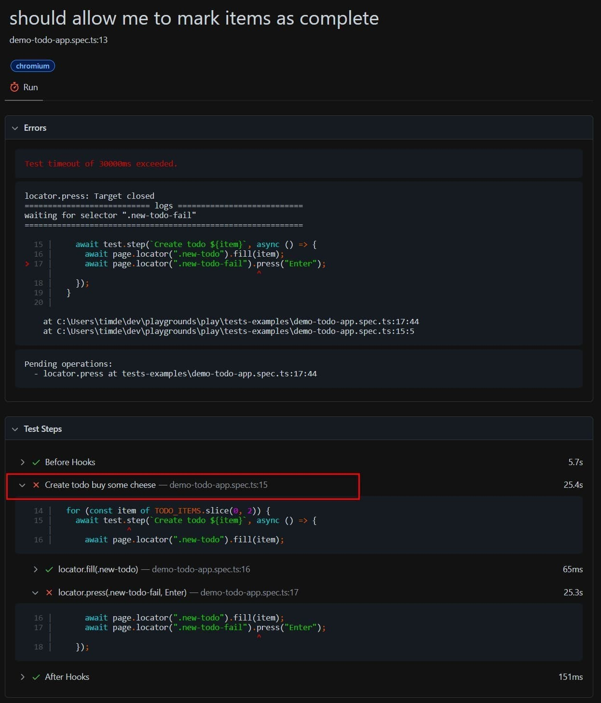

Replace comments and log statements with the `test.step` function.

```ts{3-6,9-14,16-20}
test('should allow me to mark items as complete', async ({ page }) => {
    for (const item of TODO_ITEMS.slice(0, 2)) {
        await test.step(`Create todo ${item}`, async () => {
            await page.locator('.new-todo').fill(item);
            await page.locator('.new-todo-fail').press('Enter');
        });
    }

    const firstTodo = await test.step(`Check first item`, async () => {
        const firstTodo = page.locator('.todo-list li').nth(0);
        await firstTodo.locator('.toggle').check();
        await expect(firstTodo).toHaveClass('completed');
        return firstTodo;
    });

    const secondTodo = await test.step(`Check second item`, async () => {
        const secondTodo = page.locator('.todo-list li').nth(1);
        await expect(secondTodo).not.toHaveClass('completed');
        await secondTodo.locator('.toggle').check();
        return secondTodo;
    });

    await expect(firstTodo).toHaveClass('completed');
    await expect(secondTodo).toHaveClass('completed');
});
```

The steps give a well-organized summary in the Playwright test report.




